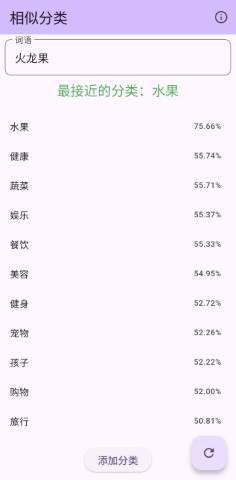
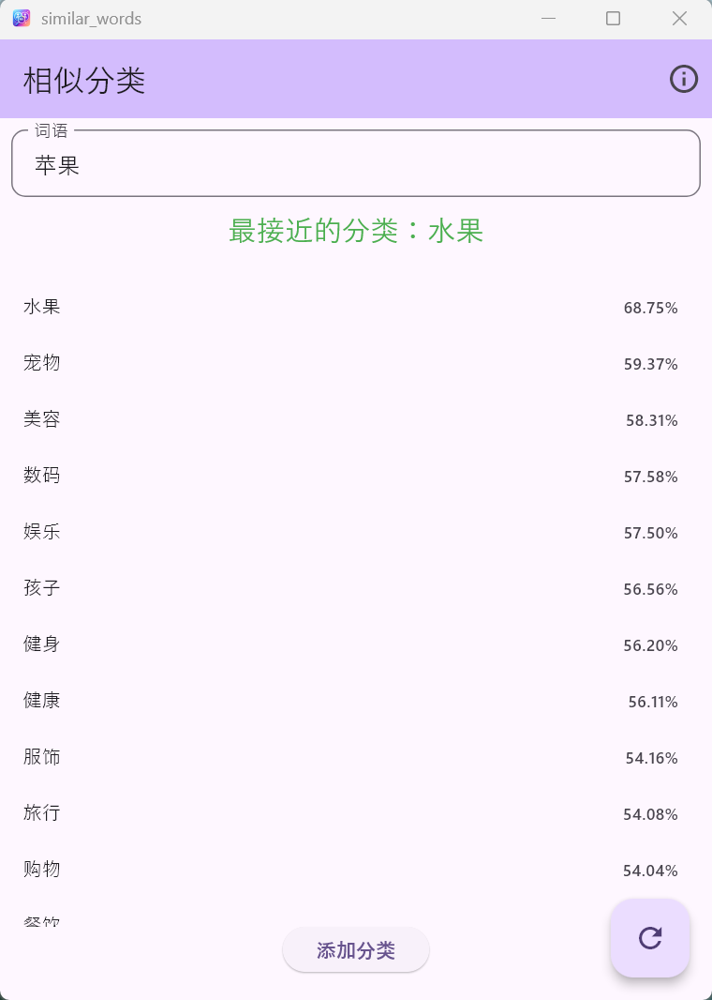

# Similarity

一个简单的句子相似度计算工具。

## Screenshot

安卓手机：



Windows:




## Usage

可以从 [release 页面](https://github.com/LeePark/similarity/releases) 下载安装包。

输入词语或者句子，可以计算出与所有分类的相似度。
首次使用时，需要联网下载模型数据。

当前使用的是 Int8 量化后的 [embeddinggemma-300m 模型](https://huggingface.co/google/embeddinggemma-300m) 。

模型格式为 `onnx`, 可以从 [这里获取](https://huggingface.co/LeePark/gemma-embedding-300M-onnx-int8) 。

Tokenizer 使用 dart 版本的 [sentencepiece](https://pub.dev/packages/dart_sentencepiece_tokenizer) 。

## Build 

只编译 android arm64 , 生成较小的安装包:

```bash
flutter build apk --target-platform android-arm64 --split-per-abi
```

生成一个所有平台的安装包:
```bash
flutter build apk 
```